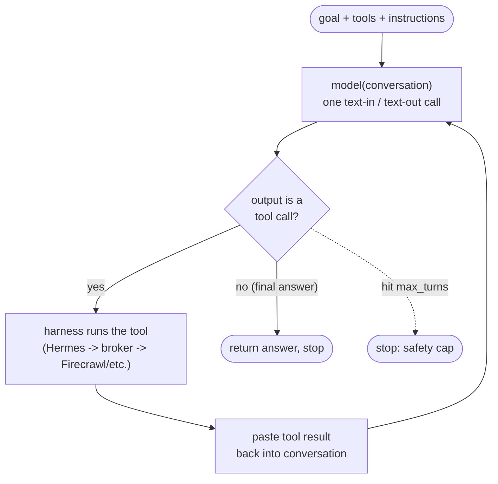

# Agent fundamentals — what an agent actually is

A from-first-principles reference. Everything fancy (multi-agent, LangGraph, planning
agents) is elaboration on the one loop at the bottom of this file. Written for this
project, so the last section maps each idea onto the real components.

---

## 1. The atom: an LLM is a text → text function

A model (DeepSeek, Kimi, etc.) does exactly one thing: **text in → text out.** Give it a
sequence of text, it produces more text. That is the entire capability.

Two facts that everything else depends on:

- **It cannot *do* anything.** It cannot search the web, run code, read a file, or
  remember. It can only *produce text*. A raw model call is one-shot: text in, text out,
  done.
- **It is stateless.** It remembers nothing between calls. Every call is a blank slate;
  the only thing it "knows" is the text you pass it *this* call.

Hold onto this: **the model can never take an action — it can only produce text.**

---

## 2. Tools: a convention for the model to *ask* for an action

How does a thing that only outputs text search the web? A convention. You tell the model
in its instructions: *"Here are tools. If you want to search, don't try to do it — output
text in this exact shape: `call research_search(query="...")`."*

The model still only outputs text. When it "calls a tool," all that literally happens is
it emits the string `call research_search(query="amie pricing")`. It didn't search
anything — it produced a string that *says* it wants to.

A separate program — the **harness** (in this project, **Hermes**) — reads that string,
sees the model is asking for `research_search`, and *the harness* actually runs it (makes
the HTTP call through the vault broker). The harness gets the result and — the pivot —
**pastes that result back into the text and calls the model again.**

So a tool call is really:
> model outputs "I want X" → harness does X → harness pastes the result into the
> conversation → harness calls the model again, now with the result in its input.

---

## 3. The loop — this is all an agent is

```
conversation = [ instructions, the goal, list of available tools ]

repeat:
    output = model(conversation)              # text in -> text out (one model call)

    if output is a tool call:
        result = harness_runs_the_tool(output)     # the harness actually does it
        conversation = conversation + [output, result]   # paste both in
        # ...and loop, so the NEXT call the model SEES the result

    else:                                     # the model wrote a normal answer
        return output                         # it's done. stop.
```

That's the agent loop. A `while` loop that keeps calling the model. Each pass, the model
looks at everything so far and does one of two things: **ask for another tool, or declare
it's finished.** The loop runs as long as the model keeps asking for tools; it ends the
moment the model writes a final answer instead.

- `max_turns` is just a safety cap on `repeat` — "if you go around N times without
  finishing, stop; something's wrong."
- **The intelligence is the model deciding, each pass, whether it needs more info (call a
  tool) or has enough (answer).** Nobody scripts that decision. That decision, made every
  iteration, *is* what "a real agent" means.



---

## 4. How it "thinks," and how it picks a tool

It doesn't think like a person. It **predicts the next word, over and over** — that's all.
But it was trained on an ocean of human text that includes people reasoning through
problems and using tools. So given a goal plus a list of tools, the most *probable*
continuation is reasoning followed by a sensible tool call. It isn't looking anything up in
a database — it's pattern-matching: *"given this situation and these tool descriptions,
what would a careful researcher's next move look like as text?"*

Two consequences that matter for the build:

1. **"Thinking" = generating reasoning text before acting.** Letting the model write *"the
   pricing isn't on the homepage, I should search for their pricing page"* before it calls
   a tool literally makes the next tool call better — each word conditions the next. That's
   "chain of thought." `--reasoning medium` turns up how much of it the model does. It's
   thinking *out loud to give itself better input.*
2. **It picks a tool by matching your tool's *description*.** The model chooses
   `research_fetch` over `research_search` because the *description you wrote* fits the
   sub-goal it's on. Tool descriptions are not human documentation — they are the model's
   **only** basis for choosing. Vague descriptions -> wrong tool calls.

And because it's probabilistic pattern-matching, not a lookup, it is **fallible**: it can
pick the wrong tool, malform arguments, or invent a tool that doesn't exist. The harness
must catch that. **This is exactly why open-weight models (DeepSeek/Kimi) are less
reliable** — they are worse at reliably emitting clean tool calls and staying on-goal over
a long loop, which is the real engineering reason the loop needs guardrails (schema
validation, bounded turns, a source-group skeleton, a separate verify pass).

---

## 5. Real agent vs. "script wearing a costume"

The difference is **who holds the control flow** — who decides what happens next.

- **Real agent:** the *model* decides, each loop iteration, via its call-a-tool-or-finish
  choice. The control flow comes out of the model's head each turn. It can react to what it
  just found ("that page didn't have it, try another source") and decide when to stop.
- **Costume:** the *code* decides — a fixed sequence (`get_pricing()` then `get_funding()`
  then ...) where the model just fills slots. The control flow is scripted; the model isn't
  really driving.

The classic research cycle (plan -> retrieve -> reflect/iterate -> synthesize) is a *real
agent loop* precisely because of the **reflect/iterate** step — the model observing what it
found and *deciding to dig deeper or stop*. Remove that decision (one fixed pass, no
agent-controlled iteration) and it becomes a costume.

Note: structure is not automatically a costume. Enforcing the *contract* (schema, the
three-outcome rule, source-URL-per-datapoint, validation) is legitimate — it constrains
what a valid *output* looks like. What must stay free is the *method*: which sources, which
queries, what a page says, when to stop. **Script the contract; free the method.**

---

## 6. A concrete trace — one company, the loop turning

"Enrich Amie":

- **Turn 1** — model sees the goal + catalog + tools. Reasons: *"I need Amie's pricing
  model; start by finding their site."* -> emits `research_search("Amie calendar pricing")`.
  Harness runs it, pastes results back.
- **Turn 2** — model sees the results. Reasons: *"amie.so/pricing looks right, fetch it."*
  -> emits `research_fetch("https://amie.so/pricing")`. Harness fetches, pastes markdown back.
- **Turn 3** — model reads the page. Reasons: *"free tier + paid tier -> pricing_model =
  freemium, source = this URL. Next, founding_year, not on this page."* -> emits
  `research_search("Amie company founded year")`.
- **...** — the model decides each next move from what it just saw, until every datapoint is
  filled or turns run out.
- **Final turn** — model has all datapoints, stops calling tools, writes the result. Loop ends.

Every step is the model choosing, mid-loop, from what it observed. No script said "fetch
amie.so/pricing" — the model got there by reasoning over the search results *it* asked for.

---

## 7. Memory

The model is stateless, so **within one company** its memory *is* the growing
`conversation` — every tool result stays pasted in, so by turn 10 it sees everything from
turns 1-9. That's **working memory**, and it's why the context window is finite and long
loops eventually need summarizing (Hermes does this automatically).

**Long-term memory** — across companies or across days — is you *writing findings to a
file/DB and loading them back into the next conversation.* There is no memory the model has
on its own; memory is always "text you put back into its input." (This is what the
persist-to-Hermes-memory step is for.)

---

## 8. How this maps onto THIS project

| Concept above | In this project |
|---|---|
| The model (text -> text) | **DeepSeek V4 Pro** via OpenRouter (the mandated open-weight model) |
| The harness (runs the loop, executes tools, pastes results back) | **Hermes** |
| Tools (model asks; harness does) | `research_search`, `research_fetch` (broker-first plugin), `read_file`/`write_file` |
| Tool execution path | Hermes -> `HTTPS_PROXY` -> **Agent Vault broker** -> Firecrawl / OpenRouter (egress allowlisted) |
| Working memory | the growing conversation in one `chat` invocation (per company) |
| Long-term memory | `results/*.json`, dossiers, and (V2) persisted Hermes skills/memory |
| The loop's safety cap | `--max-turns 60` |
| "Thinking" dial | `--reasoning medium` |
| Contract (scripted, correct to script) | `schema.json` + `validate.py` + three-outcome rule + source-URL requirement |
| Method (must stay agentic) | which sources/queries/pages the model chooses, and when it stops |
| Orchestration (NOT the research loop) | **run.sh** — claims a company, invokes the agent, validates, marks done. The driver holds the shell so the agent doesn't need one. |
| Why guardrails at all | open-weight models are fallible at long loops (see §4) — structure = reliability, not fake agency |

**One-line summary:** a real agent is a `while` loop around a stateless text->text model,
where each turn the model chooses — by predicting the most sensible next text — to either
call a tool (and get the result fed back) or finish. It "thinks" by writing reasoning
before acting, and picks tools by matching their descriptions to its current sub-goal.
Everything else is elaboration on that loop.
