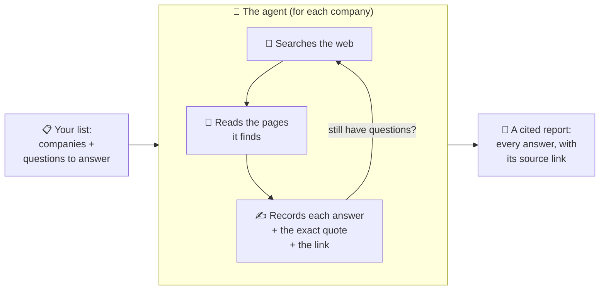
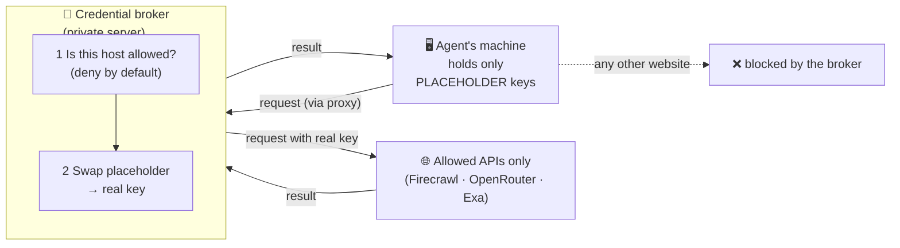

# Company Research Agent

A research assistant that looks up facts about companies for you — and **always shows
where it got each answer.**

You hand it a list of companies and a list of questions ("What's their pricing? When were
they founded? Who runs it? How much funding have they raised?"). It goes and finds the
answers on the public web, on its own, and hands you back a tidy table where **every single
answer has a link to the page it came from.**

Think of it as a diligent research intern who never makes things up, works through the
night without being asked, and staples a source to every fact.

---

## How it works

For each company, the agent decides for itself where to look — the company's own website,
news articles, funding databases — reads what it finds, and writes down each answer next to
the page that proves it. Then it moves to the next company. Nobody has to sit and watch it.

---

## The one rule that matters most: it never guesses

For every question, the agent gives one of three honest answers:

| Answer | What it means |
|---|---|
| ✅ **Found** | Here's the answer, and here's the exact page (and sentence) that says so. |
| ⚠️ **Couldn't reach** | A source probably exists, but the page wouldn't load. |
| ❔ **Not public** | Nobody has published this — so we don't pretend to know it. |

A made-up answer is treated as the worst possible mistake. If the agent can't back something
up with a real, public page, it says so plainly instead of inventing a plausible-sounding
number. That's the whole point: **you can trust every answer because you can click through
and check it yourself.**

---

## What you get

Two things per company:

- **A data file** — every answer in a neat, structured form, each with its source link and a
  quote from the page.
- **A dossier** — a simple one-page summary table you can read at a glance.

---

## A real example

Run on **Amie** (a calendar app), the agent found all 13 facts and cited each one:

- **Founded 2020** — from a TechCrunch article
- **Based in Berlin** — pulled out of their legal terms page
- **Raised $8.3M** — from German tech press
- **Founder: Dennis Müller, formerly a product manager at N26** — from TechCrunch
- **Pricing: freemium, $20/month for Pro** — from their pricing page

None of it was guessed. Every line links back to a page you can open and verify.

---

*Built to run on open web sources only — no logins, no paywalls, no private data.*

---

## How it gets better: the datapoint annotator

An agent like this doesn't improve by magic, and you **can't just auto-generate a quality
score** — a machine grading a machine misses the failures that matter. To actually make it
more accurate, a person has to look at real answers and judge them. That's what the
**annotator** is for.

It's a simple review screen: for each answer the agent produced, you see the value, the
page it cited, and a check of whether the quote is *really* on that page — then you mark it
**Pass**, **Fail**, or **Unclear**, pick a failure category if it's wrong, and jot a note.
Every click is saved immediately to `annotations/annotations.jsonl`.

This powers a simple improvement loop:

1. **Analyze** real answers — read what the agent actually produced.
2. **Categorize** the mistakes — *which* fields go wrong, and *why* (made-up value? wrong
   source? gave up too early? genuinely ambiguous question?).
3. **Improve** by experimenting — change the instructions or the tools, then re-check
   against the same cases.
4. **Repeat** — and freeze the checks that catch each fixed problem so it can't come back.

The key idea: we judge **one answer at a time**, not the whole run. Because every answer
carries its own source, each is a self-contained thing to check — which makes reviewing
tractable instead of hopeless. (Auto-generated evals skip all of this, which is exactly why
they don't work for research: the interesting failures only show up when a human reads the
actual output.)

*A real example:* reviewing the Amie run, most answers passed, but `founding_year` got
flagged **Unclear** with the note *"What does 'founded' mean — first release, or when the
company was created?"* That's not the agent being dumb — it's a genuinely ambiguous
question, and catching it tells us to sharpen the *definition*, not just the agent. That's
the kind of insight only a human looking at real output can surface.

---

## Under the hood (for the technically curious)

### What it's built on

- **[Hermes](https://hermes-agent.nousresearch.com) (Nous Research)** — the agent runtime.
  It's the "loop" that lets the model call tools, read the results, and decide what to do
  next. *Chosen because* it's an open, self-hosted agent framework with first-class tool
  and plugin support — no dependence on a closed vendor's agent platform.
- **DeepSeek** (via [OpenRouter](https://openrouter.ai)) — the reasoning model that does the
  thinking and decides where to look. *Chosen because* it's inexpensive and fast (profiling
  showed the model isn't the bottleneck), and OpenRouter is a single gateway that makes it
  easy to swap models without touching the code.
- **[Firecrawl](https://firecrawl.dev)** — turns the web into clean, readable text: one API
  for searching the web and one for fetching a page as plain markdown. *Chosen because* it
  does both search *and* page-reading in one service (fewer moving parts), and it's plumbing
  that fetches *live public pages* — every answer still traces to a real URL you can open —
  rather than a data vendor that sells pre-packaged, unverifiable records. It's also far
  cheaper than building and babysitting a web crawler that dodges anti-bot blocking.
- **[Exa](https://exa.ai)** — a second search source, wired into the same secure setup.
  *Chosen because* its neural/semantic search finds relevant pages a keyword search misses,
  giving the agent a second angle on hard-to-find facts.

### How the agent's keys and traffic are secured (MITM proxy)

The machine running the agent **never holds the real API keys.** All of the agent's web
traffic is routed through a **man-in-the-middle proxy** — a small credential broker (the
"Agent Vault") running on a separate, private server. The agent only ever carries
*placeholder* keys; the broker swaps in the real key at the last moment, on its way out.

Two things fall out of this:

1. **The real secrets never sit on the machine doing the risky work** (reading random web
   pages). If that machine were ever compromised, there are no API keys on it to steal.
2. **The agent can only reach an approved list of hosts.** Anything not on the list —
   including the agent trying to "phone home" or reach an unexpected site — is refused by the
   broker. The allow-list *is* the boundary.

### Security considerations

- **No keys on the agent.** Real credentials live only in the broker's encrypted vault;
  the agent uses placeholders.
- **Locked-down egress.** The broker denies every host by default; only the approved APIs
  get through. The agent can't reach the open internet directly.
- **No shell for the agent.** Its entire toolkit is: search the web, read a page, read a
  file, write a file. It cannot run system commands — that's kept in a separate driver
  script, not given to the model.
- **Writes are fenced to the project folder.** The agent physically cannot write files
  anywhere outside this project directory.
- **Secrets are read-protected.** Credential files (like `.env`) are blocked from being read
  by the agent's tools.
- **Public web only.** No logins, no paywalls — it only touches pages anyone can see.

**Honest limitation (current state):** on a normal laptop, the *reading* side isn't fully
sandboxed at the operating-system level — the strong guarantees above cover the keys, the
network, and where it can *write*. Full OS-level isolation (running the agent inside a
locked-down container or on its own dedicated server) is the next hardening step, and the
setup is already designed for it.

---

# Future improvements

Profiling one company (~10 minutes) showed the time goes to the agent holding every page in
memory and writing all answers in one big burst at the end — *not* the model or the network.
So the roadmap targets that directly.

### Efficiency & speed
- **Record answers one at a time, as they're found** — instead of holding every page in
  memory and writing one giant result at the end (the single biggest slowdown today).
- **Fill the easy facts for free first** — pull things like headquarters, incorporation, and
  officers from free public registries before spending a web search on them.
- **Skip re-reading pages** — cache and reuse a page already fetched, instead of fetching it
  again for a different question or a different company.
- **Use the cheap model for the easy work** — reserve a stronger (pricier) model only for the
  handful of genuinely hard-to-find facts.
- **Put the servers closer together** — the credential broker currently adds a round-trip on
  every request; co-locating it cuts latency.

### Parallelization & scale
- **Research many companies at once** — instead of one at a time, run a pool of workers in
  parallel (the difference between hours and minutes across a big list).
- **Read several pages at once per company** — fetch a company's sources concurrently rather
  than one after another.
- **Swap the local file store for a real database** — move from SQLite to PostgreSQL so many
  workers can safely write at the same time (required for the parallel version).

### Quality & features
- **Independent fact-checker pass** — a second, separate check that re-opens each cited page
  and confirms the quote is really there (catches any answer whose source doesn't back it up).
- **Chat with it** — ask questions or kick off new research conversationally, not just as a
  batch job.
- **Force the answer format at the source** — constrain the output shape so results are always
  well-formed, removing the "fix-and-retry" step.
