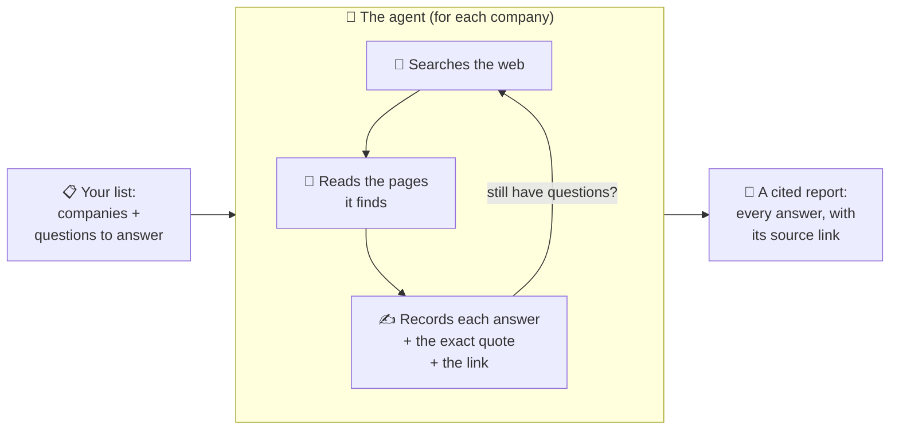

# Company Research Agent

A research assistant that looks up facts about companies for you — and **always shows
where it got each answer.**

You hand it a list of companies and a list of questions ("What's their pricing? When were
they founded? Who runs it? How much funding have they raised?"). It goes and finds the
answers on the public web, on its own, and hands you back a tidy table where **every single
answer has a link to the page it came from.**

Think of it as a diligent research intern who never makes things up, works through the
night without being asked, and staples a source to every fact.

---

## How it works

For each company, the agent decides for itself where to look — the company's own website,
news articles, funding databases — reads what it finds, and writes down each answer next to
the page that proves it. Then it moves to the next company. Nobody has to sit and watch it.

---

## The one rule that matters most: it never guesses

For every question, the agent gives one of three honest answers:

| Answer | What it means |
|---|---|
| ✅ **Found** | Here's the answer, and here's the exact page (and sentence) that says so. |
| ⚠️ **Couldn't reach** | A source probably exists, but the page wouldn't load. |
| ❔ **Not public** | Nobody has published this — so we don't pretend to know it. |

A made-up answer is treated as the worst possible mistake. If the agent can't back something
up with a real, public page, it says so plainly instead of inventing a plausible-sounding
number. That's the whole point: **you can trust every answer because you can click through
and check it yourself.**

---

## What you get

Two things per company:

- **A data file** — every answer in a neat, structured form, each with its source link and a
  quote from the page.
- **A dossier** — a simple one-page summary table you can read at a glance.

---

## A real example

Run on **Amie** (a calendar app), the agent found all 13 facts and cited each one:

- **Founded 2020** — from a TechCrunch article
- **Based in Berlin** — pulled out of their legal terms page
- **Raised $8.3M** — from German tech press
- **Founder: Dennis Müller, formerly a product manager at N26** — from TechCrunch
- **Pricing: freemium, $20/month for Pro** — from their pricing page

None of it was guessed. Every line links back to a page you can open and verify.

---

*Built to run on open web sources only — no logins, no paywalls, no private data.*
